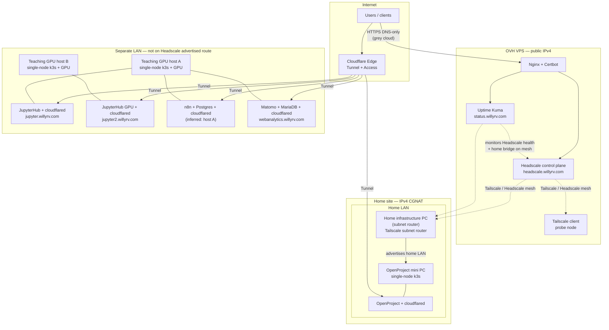

# Deployment topology

Status: Lived (as of experience posts through 2026-09-28)

Graphic overview of the computers currently hosting services described in this repository. Network addresses, CIDRs, and private hostnames are intentionally omitted from this public page. Real addresses live in gitignored `docs/inventory.local.md` and `docs/experiences/deployment-topology.local.md`.

## Security

Publishing host roles, public hostnames, and exposure methods already helps reconnaissance. Omitting LAN/Tailscale/public VPS IPs and private hostnames reduces how useful this page is as a targeting map. Do not paste private addressing into this file or into git.

## Diagram

## Hosts and exposure

| Host | Role | Services | How it is reached |
|------|------|----------|-------------------|
| OVH VPS | Public edge + VPN control plane | Nginx/Certbot, Headscale, Uptime Kuma, Tailscale probe | Direct HTTPS on the VPS (Cloudflare **DNS only** for Headscale/status); UDP STUN for embedded DERP; not behind Cloudflare Tunnel |
| Home infrastructure PC (subnet router) | Subnet router into the home LAN | Tailscale client advertising the home LAN | Outbound-only at the ISP edge (CGNAT); joins Headscale; no public inbound ports |
| OpenProject mini PC | App node | Single-node k3s, OpenProject, `cloudflared` | Public: Cloudflare Tunnel + Access → `projects.willyrv.com`. Private: via Headscale through the subnet router (Tailscale need not run on this box) |
| Teaching GPU host A | Compute / teaching node | Single-node k3s, JupyterHub (+ GPU), n8n (inferred), Matomo + MariaDB | Public: Cloudflare Tunnel + Access → `jupyter.willyrv.com`, the n8n Access-protected hostname, and `webanalytics.willyrv.com` (dashboard behind Access; tracker paths public). Not covered by the home LAN Headscale route unless this host joins the mesh or its LAN is advertised |
| Teaching GPU host B | Compute / teaching node | Single-node k3s, JupyterHub (+ GPU), local CuPy image | Public: Cloudflare Tunnel + Access → `jupyter2.willyrv.com`. Same guest-LAN caveat as host A |

## Notes

- **CGNAT:** The home ISP line cannot accept reliable inbound IPv4 port forwards; tunnels and the VPS-hosted Headscale control plane work around that.
- **Headscale vs Tunnel:** Headscale must stay on DNS-only / direct TLS (not Cloudflare Proxy or Tunnel). HTTP apps (OpenProject, JupyterHub, n8n, Matomo) use Tunnel + Access. Matomo’s tracker paths (`/matomo.js`, `/matomo.php`, and the `/piwik.*` aliases) Bypass Access; the dashboard does not.
- **n8n placement:** Experience/design material describes n8n on the high-spec single-node k3s host; that matches teaching GPU host A. Confirm locally if you split clusters later.
- **Canonical write-ups:** [Headscale / CGNAT](2026-07-19-headscale-ovh-cgnat.md), [Uptime Kuma](2026-07-20-uptime-kuma-vpn-monitoring.md), [OpenProject](2026-07-22-openproject-cloudflare-tunnel.md), [JupyterHub](2026-07-22-jupyterhub-cloudflare-tunnel.md), [GPU JupyterHub host B](2026-08-09-jupyterhub-gpu-guest2.md), [n8n](2026-07-31-n8n-k3s-cloudflare.md), [Matomo](2026-09-28-matomo-k3s-cloudflare.md).
